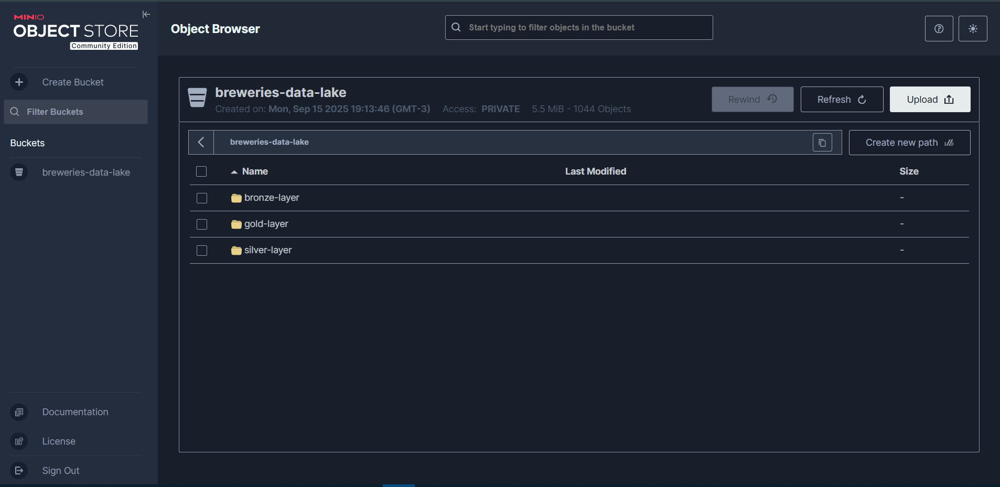

# Breweries Data Engineering Case

End-to-end **medallion** pipeline for the Open Brewery DB: **Bronze → Silver → Gold** on S3-compatible storage (**MinIO**), orchestrated with **Prefect 3**, transformed with **DuckDB** (reading/writing directly to S3), **data quality with Soda Core**, and fully containerized with Docker.

## Requirements

To run the project end-to-end, have these installed:

* **Git** – to clone this repository.
* **Make** – to run the convenience targets (`make build`, `make up`, etc.).
  Linux: `sudo apt install make` · Windows: WSL/Chocolatey (`choco install make`) or Scoop (`scoop install make`) · macOS: Xcode Command Line Tools.
* **Docker** – mandatory runtime. **Docker Desktop** recommended.
* **DuckDB CLI** (optional) – to explore `/data/warehouse.duckdb` locally; data is also queryable directly from MinIO.

<p align="center">
  
</p>

## Architecture overview

* **Orchestration – Prefect 3**
  Always-on Prefect **Server + Worker**. A deployment is registered at container start; runs are triggered **manually** via UI or CLI.
  
<p align="center">
  
</p>

> **Note – Prefect deployment link**: when you bring the stack up (`make up`), Prefect registers the deployment and logs a **deployment URL**. Copy that link, paste it in your browser, open the deployment page, and click **Run** to trigger the pipeline.

<p align="center">
  
</p>

* **Storage – MinIO (data lake, S3-compatible)**
  An easy way to run **S3-compatible storage locally** and act as a **data lake**. Object paths mirror what you would later use on **AWS S3**, so migration is a config change (endpoint/credentials), not a code rewrite.

<p align="center">
  
</p>

<p align="center">
  
</p>

* **Compute/Transform – DuckDB**
  In-process analytical engine with **native S3 I/O**. We read Bronze JSON and Silver Parquet directly from S3 and write Parquet back to S3 using `COPY ... TO 's3://...'`.

* **Formats – JSON & Parquet**
  Bronze stores **raw JSON** (with history). Silver and Gold store **columnar Parquet** (partitioned).

* **Quality – Soda Core**
  Human-readable data quality checks against a small local DuckDB warehouse (`/data/warehouse.duckdb`). Ideal for making expectations explicit and auditable.

### Data flow

* **Bronze** (raw JSON, historical):
  `s3://lake-bronze/breweries/ingestion_date=YYYY-MM-DD/page=####.json`

* **Silver** (clean, deduped Parquet, partitioned by `country/state`):
  `s3://lake-silver/breweries/country=.../state=.../*.parquet`

* **Gold** (aggregations + local warehouse):
  `s3://lake-gold/breweries_counts/ingestion_date=YYYY-MM-DD/country=.../state=.../*.parquet`
  Local DB: `/data/warehouse.duckdb`

Pagination uses the HTTP `Link` header (`rel="last"`). If absent, a deterministic capped loop stops when a page is empty or shorter than `per_page` (no `while True`).

---

## Why this architecture (legibility & simplicity first)

* **Prefect 3 → Pythonic and simple to configure.**
  Flows/tasks are plain Python with decorators; retries, logging, and deployments are straightforward. The UI provides visibility without ceremony.

* **DuckDB → extremely fast analytics, SQL-first core.**
  DuckDB is typically *much faster than pandas* and often competitive with (or faster than) Polars on analytical scans/joins/aggregations, especially with Parquet/JSON. Keeping **the core of the pipeline in SQL** centralizes business logic; Python handles orchestration and I/O at the edges.

* **MinIO → the quickest path to S3-style storage.**
  One `docker compose up` gives you an S3 API locally. Later, you can **switch to AWS S3** by changing the endpoint/credentials.

* **Soda Core → readable, codified data quality.**
  Checks are YAML that read like English, making expectations explicit and shareable across teams. Runs can be automated in CI/CD or invoked via Makefile.

### Trade-offs (honest view)

* **Prefect 3**: requires a server and a worker to be running; version-pin for stability in production.
* **DuckDB**: single-process engine (memory-bound). For multi-TB or many concurrent users, complement with a warehouse or distributed engine.
* **MinIO**: you operate it (persistence/SSL/backup). For production governance and managed durability, migrate to AWS S3.
* **Soda Core**: the `soda-core-duckdb` package can lag behind the newest DuckDB releases; you may need to pin compatible versions.

---

## Repository structure

```
breweries-data-engineering-case/
├── app/
│   ├── config.py
│   ├── pipeline.py
│   ├── io/
│   │   ├── duck.py
│   │   └── storage.py
│   ├── quality/
│   │   └── soda_scan.py
│   ├── tasks/
│   │   ├── extract.py
│   │   ├── gold.py
│   │   └── silver.py
│   └── utils/
│       ├── logging.py
│       └── models.py
├── scripts/
│   ├── run_soda_scan.sh
│   └── seed_minio.sh
├── soda/
│   ├── configuration.yml
│   └── checks/
│       ├── gold_breweries.yml
│       └── silver_breweries.yml
├── tests/
│   ├── conftest.py
│   ├── integration/
│   │   └── test_end_to_end.py
│   └── unit/
│       ├── test_pagination.py
│       └── test_transform_silver.py
├── .env              # not committed; copy from .env.example
├── .env.example
├── .gitignore
├── docker-compose.yml
├── Dockerfile
├── entrypoint.sh
├── Makefile
├── prefect.yaml
├── README.md
└── requirements.txt
```

### Folder-by-folder

* **app/** — application code

  * **config.py** — environment/config (endpoints, buckets, API)
  * **pipeline.py** — Prefect flow orchestrating Bronze → Silver → Gold
  * **io/**

    * **duck.py** — DuckDB connection & S3/MinIO configuration
    * **storage.py** — `boto3` helpers for Bronze (put/list/exists; versioned keys)
  * **quality/**

    * **soda\_scan.py** — helper to invoke Soda Core scans (useful for CI)
  * **tasks/**

    * **extract.py** — API pagination and Bronze persistence (JSON + history)
    * **silver.py** — SQL clean/dedup, write **Parquet** partitioned to S3 via DuckDB `COPY`
    * **gold.py** — SQL aggregations, write Parquet to S3, and materialize `/data/warehouse.duckdb`
  * **utils/**

    * **logging.py** — structured logging setup
    * **models.py** — Pydantic models for schema enforcement when needed

* **scripts/** — operational helpers

  * **seed\_minio.sh** — ensure buckets exist
  * **run\_soda\_scan.sh** — convenience wrapper for `soda scan`

* **soda/** — Soda Core configuration and checks

  * **configuration.yml** — DuckDB datasource pointing at `/data/warehouse.duckdb`
  * **checks/** — YAML checks for Silver/Gold datasets

* **tests/** — quality gates

  * **unit/** — fast tests (pagination parsing, transform contract)
  * **integration/** — end-to-end sanity (requires containers up)
  * **conftest.py** — test defaults (env vars, fixtures)

* **docker-compose.yml / Dockerfile / entrypoint.sh** — container orchestration, image build, and startup (Prefect Server, auto-deployment, worker)

* **prefect.yaml** — declarative deployment definition (no schedule; runs are manual)

* **Makefile** — shortcuts for build/run/test/scan/fmt

* **.env / .env.example** — environment variables (MinIO/S3 endpoint/creds)

---

## Configuration

Create a `.env` from the example:

```bash
cp .env.example .env
```

Key variables (used by both MinIO and the app through Compose):

```
AWS_ACCESS_KEY_ID=minio
AWS_SECRET_ACCESS_KEY=minio12345
AWS_DEFAULT_REGION=us-east-1
```

Ports:

* **Prefect UI** → `http://localhost:4200`
* **MinIO Console** → `http://localhost:9001` (user: `minio`, pass: `minio12345`)

---

## How to run

### A) Using the Makefile

```make
SHELL := /bin/bash

.PHONY: build up down logs test scan fmt

build:
	docker compose build

up:
	docker compose up

down:
	docker compose down

logs:
	docker compose logs -f app

test:
	docker compose run --rm app pytest -q

scan:
	docker compose run --rm app bash -lc "soda scan -d duckdb -c soda/configuration.yml soda/checks/silver_breweries.yml"

fmt:
	docker compose run --rm app bash -lc "python -m pip install ruff && ruff check --fix app"
```

Run:

```bash
make build
make up
# Prefect UI: http://localhost:4200
# MinIO UI:   http://localhost:9001

# Manual run (UI): Deployments → breweries-medallion-dev → Run
# Manual run (CLI):
docker compose exec app prefect deployment run "breweries-medallion-dev" --param ingestion_date="$(date +%F)"

# Tests
make test

# Data quality with Soda Core
make scan

# Stop services
make down
```

### B) Directly with Docker Compose

```bash
docker compose build
docker compose up
# UI at http://localhost:4200
docker compose exec app prefect deployment run "breweries-medallion-dev" --param ingestion_date="$(date +%F)"
docker compose exec app pytest -q
```

### Ad-hoc run without a deployment

Shows up in the UI because the container sets `PREFECT_API_URL`:

```bash
docker compose exec app python -m app.pipeline
# or:
docker compose exec app python -c "from app.pipeline import run; run(ingestion_date='$(date +%F)')"
```

---

## Implementation notes

* **Bronze**: pagination driven by metadata; `boto3` uploads; history preserved by date/page in the object key.
* **Silver**: DuckDB `read_json_auto` → trim/normalize/cast → deduplicate → `COPY ... TO 's3://...'` with `PARTITION_BY (country, state)`.
* **Gold**: DuckDB `read_parquet` → aggregates → `COPY ... TO 's3://...'` and `CREATE TABLE gold_breweries_counts` in `/data/warehouse.duckdb`.
* **Soda Core**: scans run against the local DuckDB warehouse using the configs in `soda/`.

---

## Troubleshooting

* **No deployments visible**: ensure `prefect.yaml` is copied into the image and the logs show `prefect deploy` at startup.
  Check inside the container: `docker compose exec app prefect deployments ls`.
* **Worker not pulling runs**: UI → **Work Pools → default** should show `app-worker` as healthy/connected.
* **UI port conflict**: change `PREFECT_PORT` in `docker-compose.yml`, rebuild, and restart.
* **Version pinning**: if `soda-core-duckdb` lags behind a newer DuckDB, align the
  
## Possible Improvements

Although the pipeline is functional end-to-end, there are several areas where it can be extended to make it more production-ready:

### 1. Data Quality Coverage

* Ensure that **data quality checks** are not only executed but **validated end-to-end** across all layers (Bronze → Silver → Gold).
* Expand the **coverage of Soda Core tests**, adding more assertions on schema, nullability, reference integrity, and distribution metrics.
* Add **unit tests** to increase code-level coverage (e.g., testing pagination, schema normalization, and transformation edge cases).

### 2. Alerts and Notifications

* Integrate Prefect pipeline with **alerting channels** (Teams, Slack, Email).
  Example: trigger a notification whenever a task fails or a data quality scan raises warnings/errors.
* This ensures quick feedback loops and faster incident response.

### 3. Scheduling and Automation

* Configure Prefect deployments with a **periodic schedule** (daily/weekly) instead of manual triggers.
* This would allow continuous ingestion and transformation without manual intervention.
* Combined with alerts, scheduling makes the pipeline closer to a production-grade data platform.

### 4. Observability & Monitoring

* Add metrics export (e.g., to Prometheus/Grafana) for pipeline runtime, task duration, and error counts.
* Extend logging with structured JSON logs to improve searchability and traceability.

---

**Summary:** Next steps should focus on **reliability (alerts, monitoring)** and **coverage (tests, quality checks)**. These improvements will turn the demo pipeline into a resilient foundation for production workloads.

